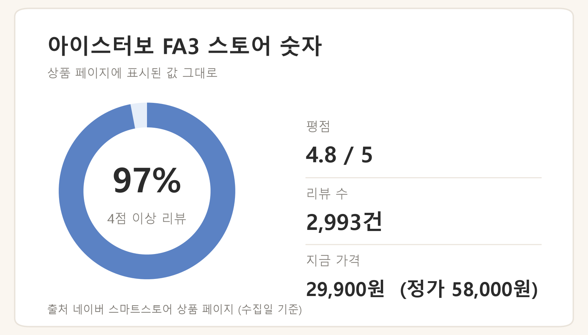
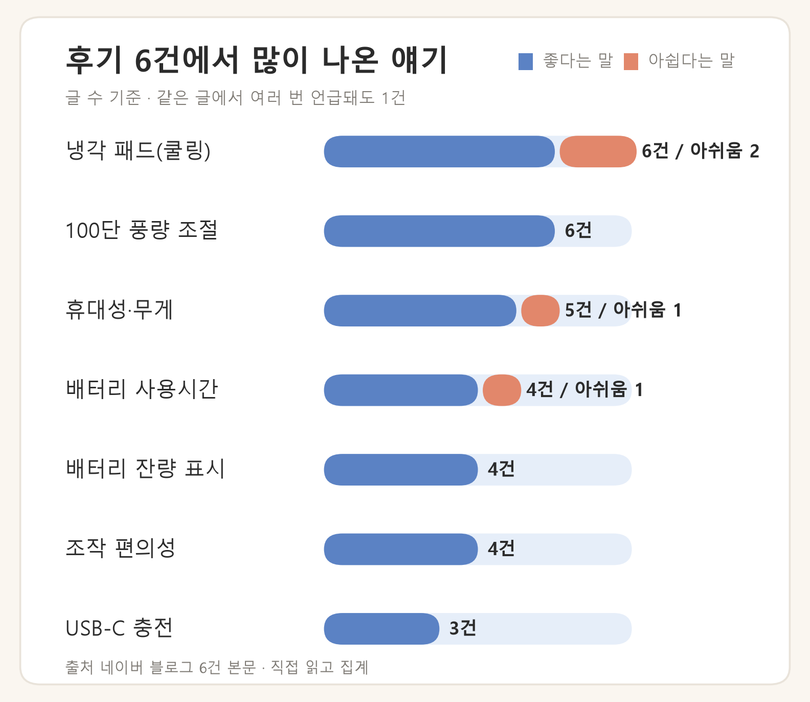

※ 이 포스팅은 쿠팡 파트너스 활동의 일환으로, 이에 따른 일정액의 수수료를 제공받습니다.

출퇴근 왕복 한 시간 반, 여름엔 회사에 도착해서 땀부터 식히는 게 순서인 분들이 있습니다. 매년 손풍기를 사도 만족스럽지 않았다면, 올해 눈에 띄는 변화는 **냉각 패드가 달린 쪽**입니다. 바람으로 식히는 게 아니라 차가운 면을 피부에 대서 열을 빼는 방식이 추가된 제품군이죠.

이 글은 그중 리뷰 2,993건이 쌓인 알로코리아 FA3의 후기를 집계해, 어떤 점이 좋고 어떤 점이 걸리는지, 누구에게 맞는 물건인지 정리합니다.

> 이 글은 제가 직접 써본 제품의 사용기가 아니라, 스토어 구매 후기와 블로그 후기를 집계해 정리한 글입니다.

## 스토어 숫자부터

상품 페이지 수치는 이렇습니다(2026-08-21 수집 기준 — 가격·리뷰 수는 이후 바뀔 수 있습니다).

- 풍량 **100단 조절**, 냉각 패드 탑재
- 리뷰 2,993건, 평점 4.8 (4점 이상 리뷰 97%)
- 정가 58,000원 → 판매가 29,900원 (수집일 기준)

냉각 기능이 있는 손풍기 중에 3만 원 아래는 흔치 않은 가격대입니다.

## 후기에서 반복되는 칭찬

블로그 후기 6건의 본문을 직접 읽고 언급 항목을 집계했습니다.

- **냉각 패드** — 6건 중 6건이 긍정 언급. 바람 얘기보다 냉각 면 얘기가 먼저 나온다는 게 눈에 띕니다. "차가운 바람"이라기보다 **차가운 면을 얼굴이나 목에 대서 열을 빼는 느낌**이라는 정리가 많습니다.
- **100단 풍량 조절** — 단계가 촘촘해서 쓸모 있다는 평(6건). 짧게 클릭만으로 세기가 조절된다는 언급도 반복됩니다(4건).
- **1단부터 바람이 세다** — 3단짜리 손풍기의 1단도 세다고 느꼈던 사람에게는 장점이자, 아래 소음 문제와 동전의 양면입니다.
- **배터리 잔량 표시** — 앞창에 잔량이 떠서 편하다는 언급(4건). 배터리는 90분 정도 무난히 버텼다는 후기가 있습니다(4건).
- **USB-C 충전** — 회사 PC에 꽂아둔다는 글(3건). 파우치가 같이 와서 가방 스크래치 걱정이 덜하다는 언급도 있습니다.

## 아쉬움은 사실상 소음 하나로 모입니다

- **소음** — 블로그 6건 중 3건이 아쉬움으로 지적. 고단에서는 실내에서 조심스럽다는 후기가 스토어에도 반복됩니다. 단점 항목이 대부분 소음 하나로 모인다는 것 자체가(4건 중 3건) 판단을 쉽게 해줍니다: **조용한 데서 쓸 물건은 아닙니다.**
- **무게감** — 배터리 때문에 무게가 있다는 언급.
- **맞바람에 약함** — 야외에서 맞바람이 불면 풍량이 약해진다는 글.

## 이런 분께 맞고, 이런 분께는 아닙니다

**맞는 경우**: 출퇴근길에 땀 식히는 게 일인 분, 야외 활동·여행이 잦은 분, 기존 손풍기의 1단도 세다고 느껴 미세 조절이 필요했던 분.

**아닌 경우**: 조용한 사무실이나 강의실에서 주로 켤 분, 가방 무게에 예민한 분.

## 가격과 구매 링크

쿠팡 판매가 기준 29,900원입니다(2026-08-25 확인 — 가격은 수시로 바뀌니 담기 전에 확인하세요).

👉 [알로코리아 FA3 쿠팡에서 보기](https://link.coupang.com/a/guJVjkUm3U)

## 자주 묻는 질문

### 비행기에 들고 타도 되나요?

조건부로 가능합니다. 배터리 내장 기기라 **위탁은 불가**하고 몸에 지녀 기내로 들고 타야 합니다. 160Wh 이하·1인 2개 기준이 적용되고, 2026년 4월 20일부터 기내 충전과 좌석 위 선반 보관이 금지됐습니다. Wh는 mAh × 3.7 ÷ 1000으로 환산합니다. (출처: 대한민국 정책브리핑 2026-08-21 / 이 제품의 배터리 Wh는 제조사 또는 탑승 항공사에 확인)

### 밤새 충전해도 되나요?

권장되지 않습니다. 행정안전부의 휴대용 선풍기 안전 안내 기준으로 취침·외출 중 충전 방치는 금지이고, 연속 3~4시간 사용 시 잠깐 쉬어주는 것이 좋습니다. KC마크 등 표시 3종을 확인하고, 차 안·직사광선 아래 보관은 피하세요. (출처: 행정안전부 2026-08-21 / KC 안전인증번호는 제조사에 확인)

---

*이 글은 스토어 구매 후기와 블로그 후기 6건, 정책브리핑·행정안전부 안내 등 공식 자료를 확인해 정리했습니다. 직접 사용한 후기가 아니며, 가격은 수집 시점 기준이므로 구매 전 최신 정보를 확인하세요.*
