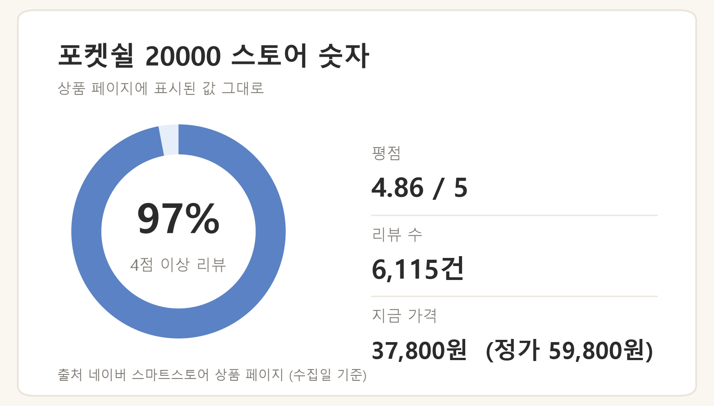
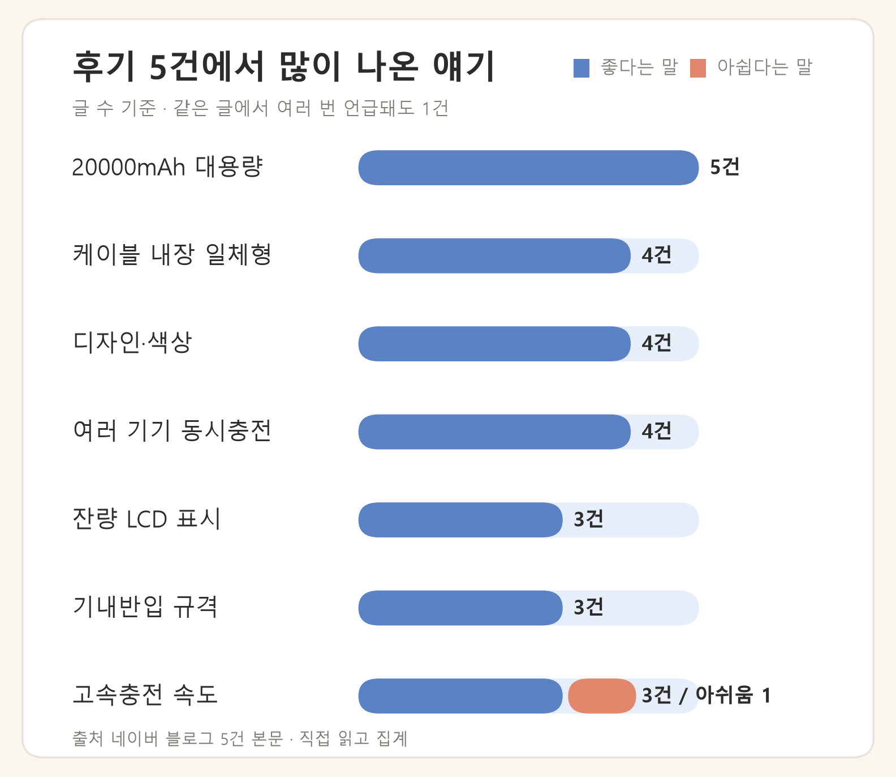

※ 이 포스팅은 쿠팡 파트너스 활동의 일환으로, 이에 따른 일정액의 수수료를 제공받습니다.

공항 게이트 앞에서 탑승권 QR을 띄우려는데 배터리가 8%. 그때부터 착륙해서 숙소에 짐 풀 때까지, 콘센트를 만날 수 없는 시간이 통째로 이어집니다. 공항 대기 3~4시간에 기내, 입국심사, 이동까지 붙으면 10시간이 우습게 넘어가고, 그 사이 지도·번역·QR결제·항공사 앱이 전부 폰 안에 있죠.

그래서 여행용 보조배터리를 알아보면 두 가지 질문이 남습니다. **20000mAh를 비행기에 들고 탈 수 있는지**, 그리고 **어떤 제품을 고를지**. 이 글은 앞의 질문을 공식 규정으로 먼저 정리하고, 뒤의 질문은 리뷰 6,115건이 쌓인 포켓쉴 20000을 예시로 후기를 분석해 답합니다.

> 이 글은 제가 직접 써본 제품의 사용기가 아니라, 스토어 구매 후기와 블로그 후기, 국토교통부 등 공식 자료를 확인해 정리한 글입니다.

## 보조배터리 기내반입 규정부터 — Wh로 따집니다

항공 규정은 mAh가 아니라 **Wh(와트시)** 기준입니다. 환산식은 간단합니다.

**용량(mAh) × 정격전압(V) ÷ 1000 = Wh**

리튬이온 셀 정격전압을 3.7V로 두면 20000mAh는 **74Wh**입니다. 정격전압을 3.6V로 적는 제품이면 72Wh, 3.85V면 77Wh — 어느 쪽으로 계산해도 100Wh 아래입니다. 제품 상세페이지에 적힌 정격전압으로 한 번만 다시 곱해보면 확실합니다.

국토교통부와 항공사 위험물 안내 기준으로 리튬이온 보조배터리는 이렇게 나뉩니다.

| 용량 구간 | 기내반입 |
| --- | --- |
| 100Wh 이하 | 별도 승인 없이 휴대 가능 (1인 최대 2개) |
| 100Wh 초과 ~ 160Wh 이하 | 항공사 사전 승인 필요 |
| 160Wh 초과 | 반입 불가 |

20000mAh(74Wh)는 첫 번째 칸입니다. 그리고 가장 많이 놓치는 규칙이 이것입니다.

**보조배터리는 위탁수하물에 넣을 수 없습니다. 무조건 기내 휴대입니다.** 캐리어에 넣어 부치면 카운터에서 다시 꺼내야 하고, 짐이 이미 들어간 뒤라면 훨씬 번거로워집니다.

2026년 4월 20일부터 시행된 국내 지침으로 기내 취급 기준도 강화됐습니다(국토교통부 2026-04-08 발표).

- 기내에서 보조배터리 **충전 금지** (폰·태블릿을 보조배터리로 충전하는 것도 금지)
- **좌석 위 선반 보관 금지** — 몸에 지니거나 앞 좌석 주머니처럼 바로 보이는 곳에
- 단자는 절연 테이프를 붙이거나 지퍼백·파우치에 개별 보관

대한항공·아시아나·제주항공·진에어·에어프레미아·에어로케이 공지를 확인한 결과 모두 같은 기준이었습니다(1인 2개, 160Wh 이하, 기내 충전·선반 보관 금지). 티웨이·에어부산·에어서울은 확인하지 못했으니 해당 항공사 이용 시 탑승 전 공지를 확인하세요. 외항사와 승인 절차는 탑승 항공사 고객센터에 문의하는 것이 확실합니다.

## 포켓쉴 20000 후기 분석 — 6,115건이 말하는 것

규정을 통과하는 20000mAh급 중에서 리뷰가 많이 쌓인 제품으로 포켓쉴 20000을 살펴봤습니다. 아래 수치는 **네이버 스마트스토어 상품 페이지 기준**입니다(2026-08-21 수집 — 가격·리뷰 수는 이후 바뀔 수 있고, 판매처가 다르면 리뷰 수도 다릅니다).

블로그 후기 5건의 본문을 직접 읽고 언급 항목을 집계한 결과입니다.

칭찬이 모이는 지점은 세 가지였습니다.

- **케이블 내장 일체형** (5건 중 4건): 선을 따로 챙길 필요가 없다는 언급이 가장 반복됩니다. 아이폰이 15부터 C타입으로 바뀌면서 집집마다 C타입·라이트닝이 섞여 있는데, 일체형에 두 단자가 같이 들어 있으면 케이블 파우치 자체가 필요 없어집니다. 내장 케이블 구성과 추가 포트는 상세페이지 표기로 확인하세요.
- **잔량 숫자 표시** (5건 중 3건): LED 점 4칸은 "한 칸 남은 게 25%인지 5%인지"를 알 수 없지만, 숫자 %가 뜨면 공항에서 지금 꽂을지 아낄지 판단이 됩니다. 사소해 보여도 후기에서 비중이 큰 항목이었습니다.
- **20000mAh 대용량** (5건 중 5건): 태블릿까지 여러 기기를 채웠다는 반응이 다수입니다.

아쉬움은 두 곳으로 모입니다.

- **완충까지 시간이 꽤 걸린다** — 스토어 후기 단점 항목에서 사실상 1순위입니다. 30분 꽂아 급속으로 채우는 그림은 기대하지 않는 편이 좋고, 출국 전날 밤에 미리 꽂아두는 쪽이 현실적입니다.
- **무게감** — 20000mAh는 셀이 그만큼 들어가는 용량이라 가벼울 수 없는 구조입니다(공식 스펙 315g). 작은 크로스백에는 빡빡할 수 있다는 언급도 있었습니다.

## 실제로 몇 번 충전되나

20000mAh가 그대로 폰에 들어가지는 않습니다. 전압 변환 손실 때문에 보통 60~70%가 실제로 들어간다고 봅니다(제품·기온·케이블에 따라 달라지는 추정치입니다).

- 배터리 4,000mAh 폰 → 약 **3.0~3.5회**
- 배터리 5,000mAh 폰 → 약 **2.4~2.8회**

2박 3일 일정에서 매일 콘센트를 찾아다니지 않아도 되는 양입니다.

| 항목 | 확인된 값 | 메모 |
| --- | --- | --- |
| 공칭 용량 | 20000mAh | 제조사 표기 |
| Wh 환산 | 74Wh (3.7V 기준) | 100Wh 기준선 아래 |
| 실효 충전 횟수 | 2.4~3.5회 | 효율 60~70% 가정한 추정치 |
| 최대 출력 | 22.5W | 제조사 표기 |
| 무게 | 315g | 제조사 표기 |
| 본체 완충 시간 | 후기 기준 "꽤 걸린다" | 충전기 W수에 따라 달라짐 |

## 이런 분께 맞고, 이런 분께는 아닙니다

**맞는 경우**: 1~3일 여행이나 장거리 이동이 잦은 분, 케이블을 챙기다 꼭 하나씩 빠뜨리는 분, 부모님 선물로 실용적인 것을 찾는 분. 특히 선물용으로는 "꺼낸다 → 붙어 있는 케이블을 꽂는다 → 숫자로 잔량을 본다" 세 단계로 끝나는 사용 흐름이 강점입니다. 케이블을 잃어버리거나 집에 두고 나오는 변수 자체가 사라지고, 잔량이 점이 아니라 숫자로 읽힙니다.

**아닌 경우**: 작은 가방에 가볍게 넣고 다녀야 하는 분, 30분 안에 급속으로 채워야 하는 분.

안전 쪽은 KC 인증 표기와 과충전·과열 보호 회로 유무를 상세페이지에서 확인하고, 가방에 오래 넣어두면 조금씩 자연 방전되니 두세 달에 한 번은 채워두는 습관이 좋습니다.

## 자주 묻는 질문

### 비행기에 몇 개까지 들고 탈 수 있나요?

1인 최대 2개, 1개당 160Wh 이하이며 위탁수하물은 불가입니다. 20000mAh는 74Wh라 개수 안에서 승인 없이 반입됩니다. (출처: 국토교통부 2026-04-08 / 외항사·승인 절차는 탑승 항공사에 확인)

### 항공사마다 기준이 다른가요?

확인한 국적사 6곳(대한항공·아시아나·제주항공·진에어·에어프레미아·에어로케이)은 공지가 모두 같은 기준입니다. 사전 승인은 100Wh 초과 제품만 해당합니다. 티웨이·에어부산·에어서울은 미확인이니 탑승 전 공지를 확인하세요.

### 비행 중에 충전해도 되나요?

안 됩니다. 보조배터리를 충전하는 것도, 보조배터리로 폰·태블릿을 충전하는 것도 기내에서는 금지입니다(2026-04-20 시행). 선반 보관도 금지라 몸에 지니거나 앞 좌석 주머니에 두세요.

### 제품에 Wh 표기가 있나요?

포켓쉴 20000의 온라인 스펙에는 Wh·KC 번호 표기가 없어 실물 라벨 확인이 필요합니다. 공식 스펙은 20000mAh·최대출력 22.5W·315g입니다. (출처: 다나와 스펙 2026-08-21 / Wh·KC 번호는 판매처 문의)

## 가격과 구매 링크

쿠팡 판매가 기준 37,800원입니다(2026-08-25 확인 — 가격은 수시로 바뀌니 담기 전에 확인하세요).

👉 [포켓쉴 20000 쿠팡에서 보기](https://link.coupang.com/a/guJQPMA6N2)

## 출발 전 체크리스트

- 보조배터리는 **기내 휴대** — 위탁수하물 금지
- 단자 절연 테이프 또는 파우치에 개별 보관
- 출국 전날 밤 완충 (본체 채울 어댑터 W수도 확인)
- 이용 항공사 규정·기내 지침 출발 전 재확인
- 동행 폰 단자(C타입/라이트닝) 미리 확인

---

*이 글은 스토어 구매 후기와 블로그 후기 5건, 국토교통부·항공사 공지 등 공식 자료를 확인해 정리했습니다. 직접 사용한 후기가 아니며, 가격·규정은 수집 시점 기준이므로 구매·탑승 전 최신 정보를 확인하세요.*
