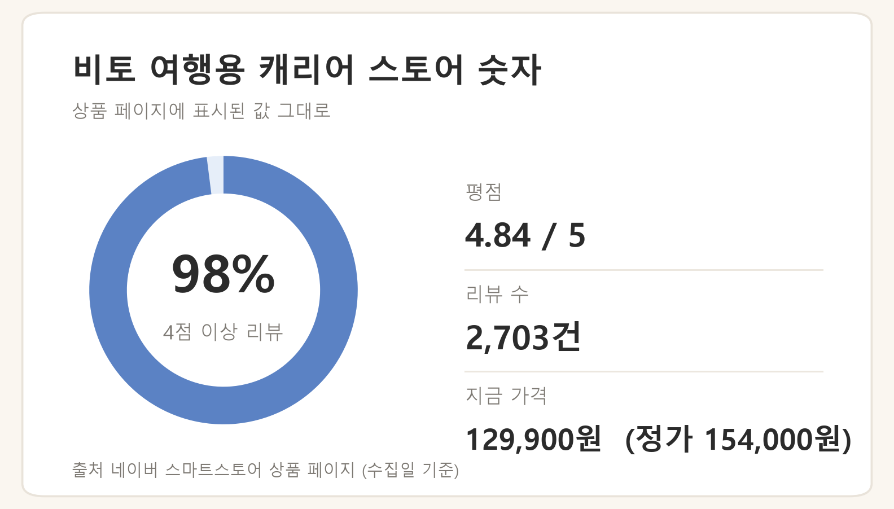
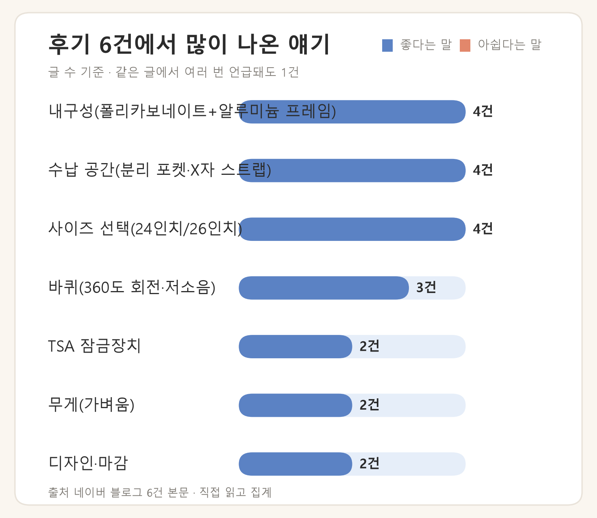

출국 이틀 전 밤, 방바닥에 짐을 다 꺼내놓고 "이게 24인치에 들어가긴 하나" 싶어지는 순간이 옵니다. 캐리어는 결국 **인치 싸움**입니다 — 일정에 비해 크면 빈 무게만큼 위탁 한도를 까먹고, 작으면 마지막 날 짐이 안 닫힙니다.

이 글은 일정별 인치 기준과 위탁수하물 규정(세 변 합 158cm, TSA 잠금)을 먼저 정리하고, 리뷰 2,703건이 쌓인 비토 프레임형 캐리어의 후기를 분석합니다.

> 이 글은 제가 직접 써본 제품의 사용기가 아니라, 스토어 리뷰 2,703건과 블로그 후기 6건, 항공사 공식 안내를 확인해 정리한 글입니다.

## 며칠 여행이면 몇 인치인가

후기들이 말하는 기준은 단순합니다.

| 일정 | 권장 크기 |
| --- | --- |
| 2~3일 | 기내용 (20인치 이하) |
| 3~5일 | **24인치 (66cm)** |
| 일주일 전후 | 26인치 (72cm) |

여기서 자주 놓치는 게 **빈 캐리어 무게도 짐 무게**라는 점입니다. 위탁 한도가 23kg라면, 본체 3.7kg짜리 캐리어는 시작부터 약 16%를 차지합니다. 짧은 일정에 큰 캐리어를 사면 그만큼 손해입니다.

## 위탁 규정과 TSA 잠금 — 사기 전에 확인할 것

**세 변 합 158cm** 기준을 두는 항공사가 많습니다. 26인치(72cm)면 나머지 두 변의 여유가 넉넉하지 않으니, 타는 항공사 예약 페이지나 고객센터에서 실측 기준을 확인하세요. 무게 한도는 운임마다 다릅니다 — 대형항공사는 158cm·23kg 기준이 일반적이지만, 제주항공 스탠다드 운임은 무료 15kg, 티웨이 국제선은 세 변 합 203cm 기준입니다(2026-08-24 확인).

**미국 노선은 보안 검색에서 가방을 열어볼 수 있습니다.** TSA 승인 잠금(빨간 다이아몬드 표식)이면 마스터키로 열고 다시 잠그지만, 미인증 자물쇠는 잘리거나 제거될 수 있습니다. 검사 여부는 보안당국 재량입니다. (출처: Travel Sentry 2026-08-24)

그리고 짐 쌀 때 가장 잘 까먹는 것 — **보조배터리는 캐리어(위탁수하물)에 넣을 수 없습니다.** 반드시 기내로 들고 타야 합니다. 자세한 규정은 [보조배터리 기내반입 규정 정리](/gblog/posts/power-bank-20000-flight/) 글에 있습니다.

파손은 공항을 나서기 전에 접수하는 게 편합니다. 수하물 벨트에서 바로 확인하고 사진과 수하물표를 챙기세요.

## 비토 캐리어 후기 분석 — 2,703건이 말하는 것

지퍼 대신 프레임 잠금 두 개로 닫는 프레임형입니다. 스토어 수치는 이렇습니다(2026-08-24 수집 기준 — 가격·리뷰 수는 이후 바뀔 수 있습니다).

- 24인치 66cm / 26인치 72cm, 24인치 본체 무게 약 3.7kg
- TSA 잠금, 지퍼 없는 프레임형
- 정가 154,000원 → 129,900원 (수집일 기준)

블로그 후기 6건의 언급 항목을 집계한 결과입니다.

- **프레임 내구성** (6건 중 4건) — 폴리카보네이트+알루미늄 프레임이 맞물려 닫히는 구조라 "지퍼 터짐 걱정이 없다"는 후기가 많습니다. 실제로 지퍼가 터진 경험 때문에 프레임형을 골랐다는 글이 눈에 띕니다.
- **수납** (6건 중 4건) — 분리 포켓과 X자 스트랩. 양쪽이 나뉘고 짐 고정 밴드가 있어 마지막 날 늘어난 짐을 잡아줍니다.
- **사이즈 선택 만족** (6건 중 4건) — 24인치가 3~5일 일정에 맞았다는 후기, 26인치치고 가볍다는 반응.
- **360도 바퀴** (6건 중 3건) — 네 바퀴가 따로 돌아 방향 틀 때 걸림이 적다는 평.
- 손잡이 단계 조절이 흔들림 없다, 방수커버를 기본으로 준다는 언급도 있습니다.

아쉬움은 이렇게 모입니다.

- **가격** — 10만 원을 넘겨 부담된다는 말. 대신 몇 년 쓸 물건이라 넘어갔다는 쪽이 다수입니다.
- **프레임형 특유의 여닫기** — 지퍼형만 쓰던 사람에게는 처음에 낯섭니다.
- **확장 지퍼 없음** — 프레임형 구조상 확장 수납이 필요하면 상세페이지를 확인하고 다시 비교하세요.

## 정리 — 누구에게 어느 사이즈인가

- 3~5일 해외여행이 잦은 분 → **24인치**
- 일주일 전후 장거리 → **26인치**
- 기내용 하나로 끝내고 싶은 분 → 20인치 쪽
- 확장 수납이 꼭 필요한 분 → 지퍼 확장형과 다시 비교

## 자주 묻는 질문

### 보조배터리는 어디에 넣나요?

위탁은 안 됩니다. 반드시 기내 휴대이며, 160Wh 이하 1인 2개까지입니다. 기내 사용·충전은 전면 금지, 선반 보관도 금지라 앞 좌석 주머니에 두고, 단자에는 절연테이프를 감으세요. (출처: 국토교통부 보도자료 2026-04-08)

### 26인치는 위탁이 되나요?

가능하지만 운임별 무게 기준이 다릅니다. 대형항공사는 158cm·23kg 기준, 제주항공 스탠다드는 무료 15kg, 티웨이 국제선은 세 변 합 203cm입니다. 무료 kg은 예약 확인서의 수하물 항목이나 항공사에서 확인하세요. (출처: 제주항공 공식 2026-08-24)

### TSA 잠금이 꼭 필요한가요?

미국 노선이면 있어야 자물쇠가 잘리지 않습니다. TSA 인증(빨간 다이아몬드 표식) 잠금은 마스터키로 열고 다시 잠그지만, 미인증 자물쇠는 잘리거나 제거될 수 있습니다. (출처: Travel Sentry 2026-08-24 / 파손 보상은 항공사 또는 AskTSA에 문의)

## 출발 전 딱 두 가지

1. 보조배터리를 캐리어에 안 넣었는지
2. 캐리어 세 변 합이 타는 항공사 기준 안인지

---

*이 글은 스토어 리뷰 2,703건과 블로그 후기 6건, 국토교통부·항공사·Travel Sentry 공식 안내를 확인해 정리했습니다. 직접 사용한 후기가 아니며, 가격·규정은 수집 시점 기준이므로 구매·탑승 전 최신 정보를 확인하세요.*
